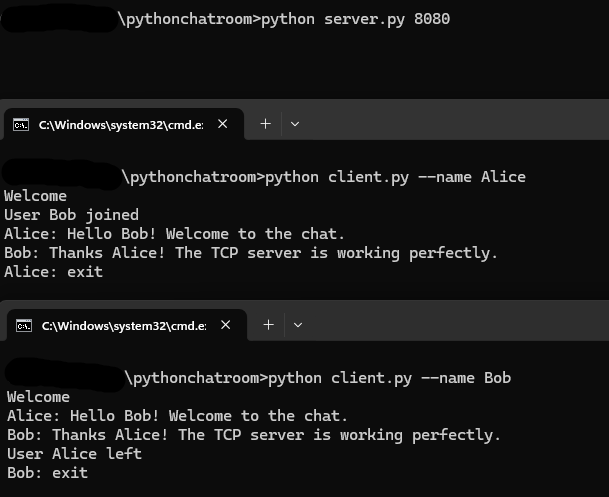

# Python Networking Chatroom

This project implements a multi-client chatroom in Python using both **TCP** and **UDP** protocols. It was developed as part of a university networking assignment to explore socket programming, multithreading, and client-server communication.

---

## Features

- **TCP Chatroom**
  - Multi-threaded server (`ServerTCP`) handling multiple clients.
  - Clients (`ClientTCP`) can connect, send, and receive messages in real-time.
  - Unique client names enforced.
  - Broadcast messages when users join, leave, or send messages.
  - Graceful server shutdown.

- **UDP Chatroom**
  - Server (`ServerUDP`) manages multiple clients over UDP.
  - Client (`ClientUDP`) can join, send, and receive messages.
  - Broadcast functionality for all connected clients.
  - Supports client join/exit notifications.

- **Threading & Exception Handling**
  - Uses Python's `threading` module to handle simultaneous client connections.
  - Try-except blocks to handle socket errors and avoid crashes.

---

## Project Structure
networking-chatroom/
├─ chatroom.py # Main chatroom classes: ServerTCP, ClientTCP, ServerUDP, ClientUDP
├─ server.py # Example server runner
├─ client.py # Example client runner
├─ chatroom.png # Example screenshot of chatroom running
└─ README.md

---

## Usage

### TCP Example

**Start the server:**
```bash
python server.py port 8080
```
**Start the client:**
```bash
python client.py --name Alice
python client.py --name Bob
```

## Demo / Example Run

Below is a screenshot showcasing an example run of the chatroom programs:

